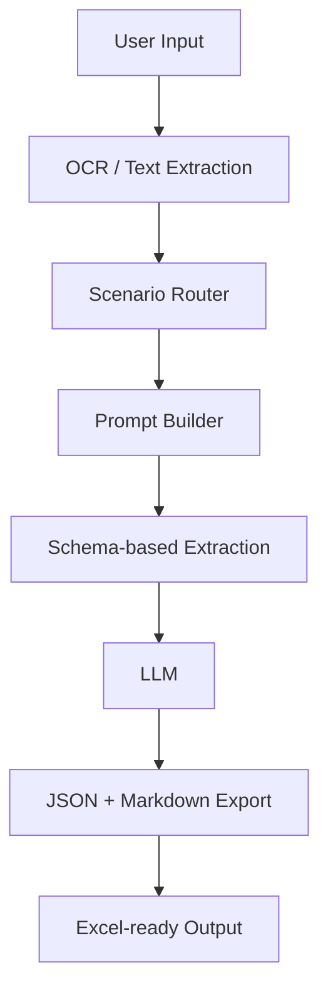
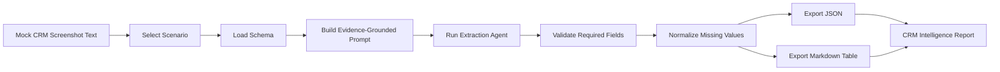

# Enterprise CRM AI Assistant

Scenario-aware AI extraction pipeline for turning CRM screenshots or OCR text into structured competitive intelligence reports.


**Key features:** OCR-ready input, scenario-aware prompts, schema-driven extraction, JSON and Markdown exporters, Excel-ready CRM intelligence tables.

## Project Overview

Enterprise CRM teams often review competitor membership pages, campaign screenshots, lifecycle messages, and benefit communications. These sources are semi-structured: useful details are present, but they are hard to compare across brands, campaigns, and time periods.

This project demonstrates a lightweight AI engineering workflow for converting CRM screenshot text into structured records. A user provides OCR text and selects a scenario type, then the system routes the request through the matching schema, builds an extraction prompt, and exports both JSON and Markdown.

Structured CRM extraction matters because it turns manual research into reusable data. LLMs improve this workflow by handling messy text, varying wording, and incomplete screenshots while still following strict output contracts.

## Architecture



See [docs/architecture.md](docs/architecture.md) for component-level details.

## Workflow



See [docs/workflow.md](docs/workflow.md) for the execution pipeline.

## Features

- OCR-based extraction workflow using text transcripts or screenshot descriptions.
- Scenario-aware prompts for six CRM competitive intelligence use cases.
- Structured JSON generation for downstream automation.
- Markdown report generation for analyst review.
- Schema validation through a scenario registry and required field contracts.
- Enterprise CRM workflow automation patterns without external services.
- Deterministic mock extractor that runs locally without API keys.

## Example

### Example Input

```text
Scenario: membership_tier_benefits

Mock OCR text:
Information Source Channel: Brand A Loyalty Program benefits page
Tier Benefit Channel: Official Mini Program
Update Date: 2024-10-08
Membership Tier: Tier 1, Tier 2, Tier 3
Birthday Benefit: Birthday month double points, once per year
Tier Retention Benefit:
```

### Example Output

| Field | Exists | Extracted Content |
| --- | --- | --- |
| Information Source Channel | Yes | Brand A Loyalty Program benefits page |
| Tier Benefit Channel | Yes | Official Mini Program |
| Update Date | Yes | 2024-10-08 |
| Membership Tier | Yes | Tier 1, Tier 2, Tier 3 |
| Birthday Benefit | Yes | Birthday month double points, once per year |
| Tier Retention Benefit | Not Mentioned | Not Mentioned |

```json
{
  "scenario": "membership_tier_benefits",
  "records": [
    {
      "field": "Information Source Channel",
      "exists": "Yes",
      "extracted_content": "Brand A Loyalty Program benefits page"
    },
    {
      "field": "Tier Retention Benefit",
      "exists": "Not Mentioned",
      "extracted_content": "Not Mentioned"
    }
  ]
}
```

Full mock examples are available in:

- [examples/input/membership_benefits.md](examples/input/membership_benefits.md)
- [examples/input/sample_ocr.txt](examples/input/sample_ocr.txt)
- [examples/output/structured_table.md](examples/output/structured_table.md)
- [examples/output/structured_output.json](examples/output/structured_output.json)

## Prompt Engineering

The project uses prompt engineering as a control layer for structured extraction:

- **Scenario routing:** each input is mapped to one CRM scenario before extraction.
- **Schema design:** each scenario has explicit fields defined in `src/crm_ci_agent/schemas.py`.
- **Evidence-based extraction:** the agent only fills fields supported by the source text.
- **Hallucination prevention:** missing fields are returned as `Not Mentioned` instead of inferred.
- **JSON validation:** output is designed around stable record fields: `field`, `exists`, and extracted content.

See [docs/prompt-engineering.md](docs/prompt-engineering.md).

## Technical Highlights

- LLM Workflow
- OCR
- Structured Extraction
- Prompt Engineering
- JSON Schema
- Modular Design
- Enterprise Automation

## Project Structure

```text
enterprise-crm-ai-assistant/
├── docs/
│   ├── architecture.md
│   ├── workflow.md
│   ├── prompt-engineering.md
│   └── demo.md
├── examples/
│   ├── input/
│   │   ├── membership_benefits.md
│   │   └── sample_ocr.txt
│   └── output/
│       ├── structured_output.json
│       └── structured_table.md
├── src/
│   ├── crm_ci_agent/
│   │   ├── agent.py
│   │   ├── cli.py
│   │   ├── exporters.py
│   │   ├── ocr.py
│   │   ├── prompts.py
│   │   └── schemas.py
│   └── run_demo.py
├── README.md
├── LICENSE
├── requirements.txt
└── .gitignore
```

## Quick Start

```bash
python -m venv .venv
source .venv/bin/activate
pip install -r requirements.txt
```

Run the local demo:

```bash
python src/run_demo.py \
  --scenario membership_tier_benefits \
  --input examples/input/sample_ocr.txt \
  --format both
```

Run the package module directly:

```bash
PYTHONPATH=src python -m crm_ci_agent.cli \
  --scenario member_day_campaign \
  --input examples/sample_inputs/member_day_campaign.txt \
  --format markdown
```

## Disclaimer

This project is a personal reimplementation built with anonymized mock data.

No proprietary prompts, customer data, internal documents, or confidential company information are included.
