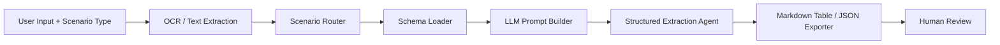
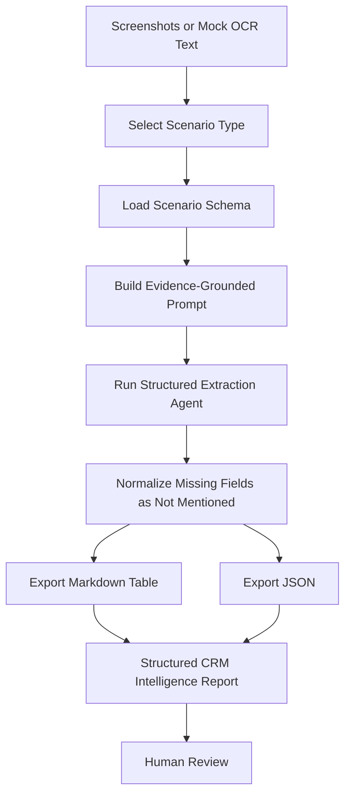

# Enterprise CRM AI Assistant

LLM-ready CRM competitive intelligence agent for scenario-based structured extraction from screenshot OCR text.


## Project Overview

Enterprise CRM teams often review competitor membership programs, campaign pages, lifecycle messages, and benefit communications. These materials usually arrive as screenshots, OCR text, or manually copied snippets. Turning them into consistent competitive intelligence tables is repetitive and error-prone.

This project demonstrates a lightweight AI assistant architecture for structured CRM extraction:

1. Receive screenshot OCR text and a selected CRM scenario type.
2. Route the request to a scenario-specific schema.
3. Build an evidence-grounded extraction prompt.
4. Extract structured records.
5. Export Markdown tables and JSON for review or downstream analysis.

The current implementation includes a deterministic mock extractor so the project runs without an API key. The code is designed so a real LLM provider can be added without changing the schema registry or exporters.

## Why This Project

This repository is built as a portfolio-grade example of applied LLM engineering, not a generic chatbot. It focuses on a realistic business workflow where LLMs are useful because the input is semi-structured, the output must be consistent, and missing information must be handled carefully.

It highlights:

- LLM agent workflow design
- Prompt engineering for structured extraction
- Scenario routing and schema selection
- Evidence-grounded CRM intelligence extraction
- Clean Markdown and JSON outputs
- Safe public demo data with no confidential information

## Features

- Six CRM competitive intelligence scenarios.
- Scenario-specific extraction schemas.
- OCR/text extraction placeholder for screenshot workflows.
- Prompt builder with strict evidence rules.
- Structured extraction agent interface.
- Markdown table exporter.
- JSON exporter.
- Mock input and output examples for public GitHub demos.
- No API key required for the included deterministic demo.

## Supported Scenarios

| Scenario ID | Scenario |
| --- | --- |
| `membership_tier_benefits` | Membership Tier Benefits |
| `member_day_campaign` | Member Day Campaign |
| `existing_customer_communication_benefits` | Existing Customer Communication & Benefits |
| `prospect_communication_benefits` | Prospect Communication & Benefits |
| `prospect_new_existing_member_benefits` | Prospect/New/Existing Member Benefits |
| `new_customer_communication_benefits` | New Customer Communication & Benefits |

## Architecture

The system is organized as a small extraction pipeline:



See [docs/architecture.md](docs/architecture.md) for the full architecture notes and component mapping.

## Workflow



See [docs/workflow.md](docs/workflow.md) for the end-to-end workflow.

## Demo

This repository includes a complete anonymized mock demo for `membership_tier_benefits`.

This demo uses anonymized mock OCR text reconstructed from public-style loyalty program screenshots.

Demo files:

| File | Purpose |
| --- | --- |
| [examples/input/membership_tier_benefits.md](examples/input/membership_tier_benefits.md) | Demo input description |
| [examples/sample_ocr_text/membership_tier_benefits.txt](examples/sample_ocr_text/membership_tier_benefits.txt) | Mock OCR extracted text |
| [examples/output/membership_tier_benefits_table.md](examples/output/membership_tier_benefits_table.md) | Markdown table output |
| [examples/output/membership_tier_benefits.json](examples/output/membership_tier_benefits.json) | JSON output |

See [docs/demo.md](docs/demo.md) for the demo preview.

## Example Output

### Markdown Table

| Field | Exists | Extracted Content |
| --- | --- | --- |
| Information Source Channel | Yes | Brand A Loyalty Program mini program membership benefits page |
| Tier Benefit Channel | Yes | Official Mini Program |
| Update Date | Yes | 2024-10-08 |
| Membership Tier | Yes | Tier 1, Tier 2, Tier 3, Tier 4, Tier 5, Tier 6 |
| Tier Retention Benefit | No | Not Mentioned |

### JSON

```json
{
  "scenario": "membership_tier_benefits",
  "records": [
    {
      "field": "Information Source Channel",
      "exists": "Yes",
      "extracted_content": "Brand A Loyalty Program mini program membership benefits page"
    },
    {
      "field": "Tier Retention Benefit",
      "exists": "No",
      "extracted_content": "Not Mentioned"
    }
  ]
}
```

## Prompt Engineering

The prompt design is built around scenario routing and strict extraction contracts:

- Route each request by CRM scenario type.
- Load only the schema fields relevant to that scenario.
- Extract only evidence-backed information.
- Return `Not Mentioned` when the source does not support a field.
- Export the same extracted records as Markdown and JSON.

See [docs/prompt-design.md](docs/prompt-design.md) for the engineering notes.

## Technical Highlights

- LLM-based structured extraction
- Scenario routing
- Schema-driven output
- Evidence-grounded extraction
- Markdown/JSON exporters
- Mock OCR pipeline
- Designed for CRM competitive intelligence workflows

## Tech Stack

- Python
- Prompt engineering
- OCR placeholder
- LLM-ready extraction interface
- Dataclass-based structured records
- Markdown and JSON exporters

## Project Structure

```text
enterprise-crm-ai-assistant/
├── docs/
│   ├── architecture.md
│   ├── demo.md
│   ├── demo_workflow.md
│   ├── prompt-design.md
│   ├── prompt_design.md
│   └── workflow.md
├── examples/
│   ├── input/
│   │   └── membership_tier_benefits.md
│   ├── output/
│   │   ├── membership_tier_benefits.json
│   │   └── membership_tier_benefits_table.md
│   ├── sample_inputs/
│   ├── sample_ocr_text/
│   └── sample_outputs/
├── src/
│   ├── crm_ci_agent/
│   │   ├── agent.py
│   │   ├── cli.py
│   │   ├── exporters.py
│   │   ├── ocr.py
│   │   ├── prompts.py
│   │   └── schemas.py
│   └── run_demo.py
├── README.md
├── LICENSE
├── requirements.txt
└── .gitignore
```

## How to Run

Create a virtual environment and install dependencies:

```bash
python -m venv .venv
source .venv/bin/activate
pip install -r requirements.txt
```

Run the included CLI demo:

```bash
python src/run_demo.py \
  --scenario member_day_campaign \
  --input examples/sample_inputs/member_day_campaign.txt \
  --format both
```

Run the package module directly:

```bash
PYTHONPATH=src python -m crm_ci_agent.cli \
  --scenario membership_tier_benefits \
  --input examples/sample_inputs/membership_tier_benefits.txt \
  --format markdown
```

## Disclaimer

This is a personal reimplementation using anonymized mock data. It does not contain confidential company information, proprietary prompts, private customer data, or real brand screenshots.
