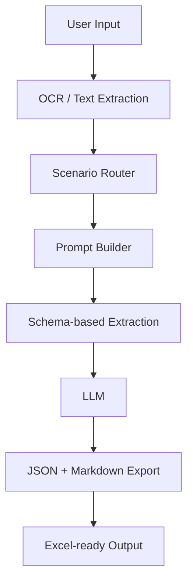

# Architecture

This project is organized as a small, replaceable extraction pipeline. The demo uses a deterministic local extractor, but the boundary is designed so a real LLM provider can be added without rewriting the schema registry or exporters.

## System Diagram

## Components

| Component | File | Responsibility |
| --- | --- | --- |
| OCR/Text input | `src/crm_ci_agent/ocr.py` | Reads a transcript file and represents where OCR or vision extraction would plug in. |
| Scenario registry | `src/crm_ci_agent/schemas.py` | Defines supported scenarios and their expected fields. |
| Prompt builder | `src/crm_ci_agent/prompts.py` | Builds scenario-specific prompts with evidence rules. |
| Extraction agent | `src/crm_ci_agent/agent.py` | Coordinates schema loading and extraction. |
| Exporters | `src/crm_ci_agent/exporters.py` | Converts structured records into Markdown and JSON. |
| CLI | `src/crm_ci_agent/cli.py` | Provides a simple command-line interface for local demos. |

## Design Notes

- The scenario enum prevents unsupported task types from silently falling through.
- Field schemas keep extraction output stable across different CRM screenshots.
- Exporters are separated from extraction logic so additional formats can be added later.
- The mock extractor keeps the project runnable in a public portfolio without API keys or private data.

## Production Extension Points

For a production version, replace `DeterministicMockExtractor` with an LLM-backed extractor that returns the same `ExtractionResult` shape.

Recommended additions:

- OCR or multimodal screenshot parsing.
- JSON schema validation at the API boundary.
- Evidence spans for each extracted field.
- Confidence scoring and human review queues.
- Batch processing for recurring competitive intelligence monitoring.
