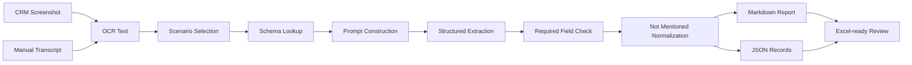

# Workflow

The workflow converts screenshot-derived text into an analyst-friendly CRM intelligence report.

## Execution Steps

1. Prepare OCR text or a manual transcript from CRM screenshots.
2. Choose a scenario such as `membership_tier_benefits`.
3. Load the matching schema from `schemas.py`.
4. Build a prompt that lists the required fields and evidence rules.
5. Extract each field into a structured record.
6. Normalize missing fields to `Not Mentioned`.
7. Export Markdown for review and JSON for downstream automation.

The included demo uses mock OCR text only. No real screenshots or customer data are required.
