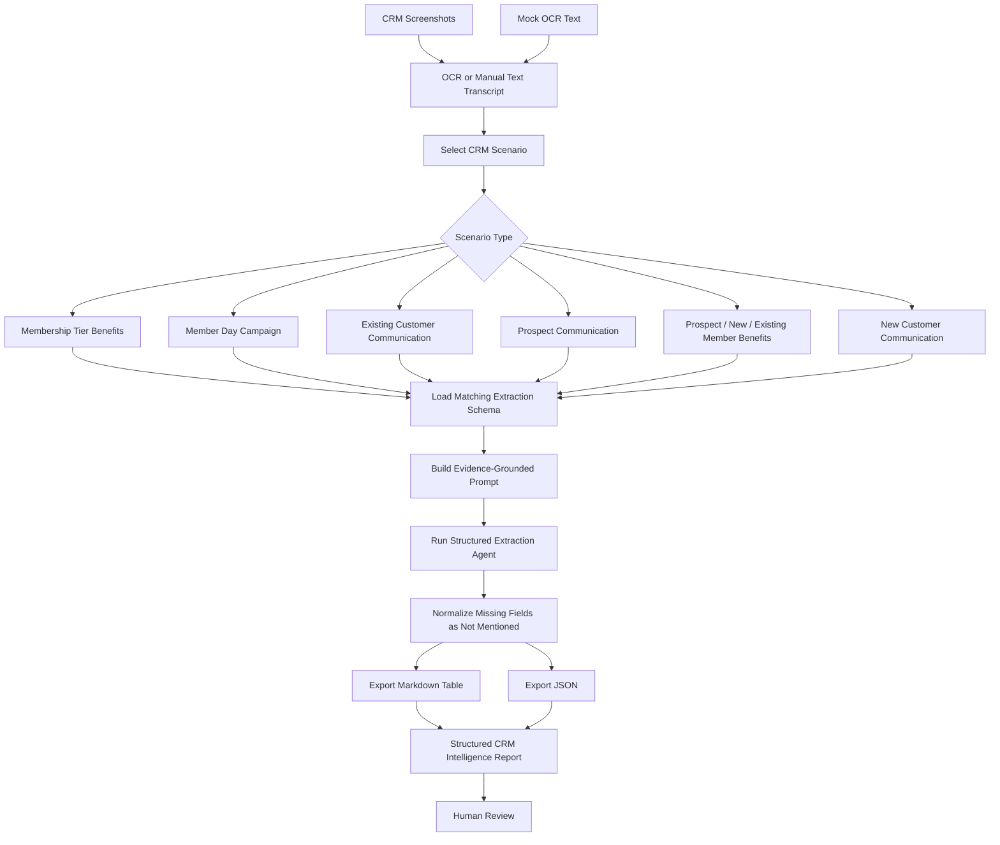

# Workflow

This workflow shows how screenshots or OCR text become a structured CRM competitive intelligence report.

## End-to-End Steps

1. Collect screenshots or receive OCR text from CRM touchpoints.
2. Select the CRM scenario type.
3. Load the scenario-specific schema.
4. Build an extraction prompt that requires evidence-based answers.
5. Extract structured records with `field`, `exists`, and `extracted_content`.
6. Export both Markdown and JSON.
7. Review missing or uncertain fields before downstream use.

The demo uses mock OCR text and fictional brand data so it can be safely shared in a public portfolio repository.
